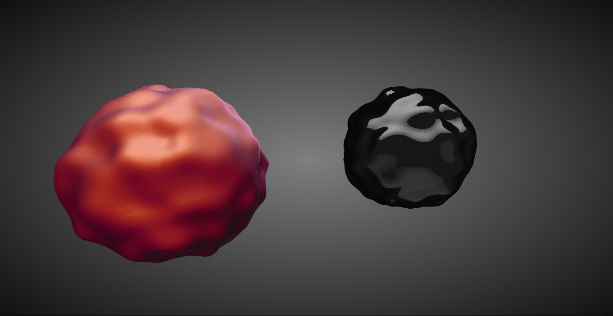

scotlandjs-2014
=============

"Getting started with three.js and WebGL"
Three.js/WebGL presentation for ScotlandJS 2014

About
-----

The 20-minute talk about three.js and WebGL was based on a live-code-ish session with this slides as support http://slides.com/jaumesanchez/scotlandjs-2014/

The plan was to show how to get from an empty page to [a working demo](http://www.clicktorelease.com/talks/scotlandjs-2014/demo/) by typing all the code. 

I decided to create a tool that would "play" the diff between different stages of the project, and explain what was going on. It wasn't perfect, but it wasn't terrible either. Another library might come out of this.

Here's the code player: http://www.clicktorelease.com/talks/scotlandjs-2014/
and here's the recording of the talk in video format: http://vimeo.com/96477742

It covers:

* setting uo
* adding the WebGL renderer
* adding a render loop
* adding a scene and a camera
* adding a mesh with a normal material
* animating a mesh with JavaScript
* replacing the default material with a shader
* creating a custom shader

The final shader is a Spherical Environment Mapping shader, like used in the [GLSL Spherical Normal Mapping](http://www.clicktorelease.com/code/spherical-normal-mapping/#) and explained in ["Creating a Spherical Reflection/Environment Mapping shader"](http://www.clicktorelease.com/blog/creating-spherical-environment-mapping-shader)

Use all the code you want, and let me know if you do!

Credits
-------

Coded using [three.js](http://www.threejs.org), [jsdiff](https://github.com/kpdecker/jsdiff) and [highlight.js](http://highlightjs.org/)

License
-------

MIT licensed

Copyright (C) 2014 Jaume Sanchez Elias http://twitter.com/thespite

http://www.clicktorelease.com